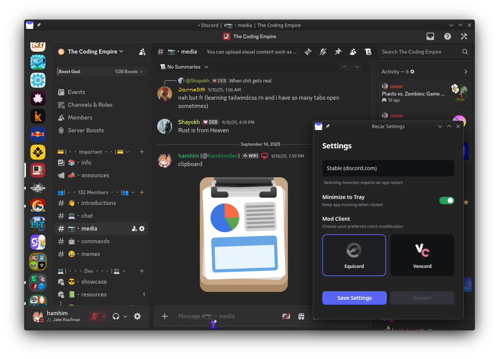

 

### A Linux Discord Client

Recar is a Discord client for Linux that is built with Electron and uses the Discord web app as its base. It has client mods such as Vencord built in, Wayland support, and a little bit more.
https://cutely.strangled.net/recar

## Installing Recar

https://cutely.strangled.net/recar/install

todo

## License

MIT