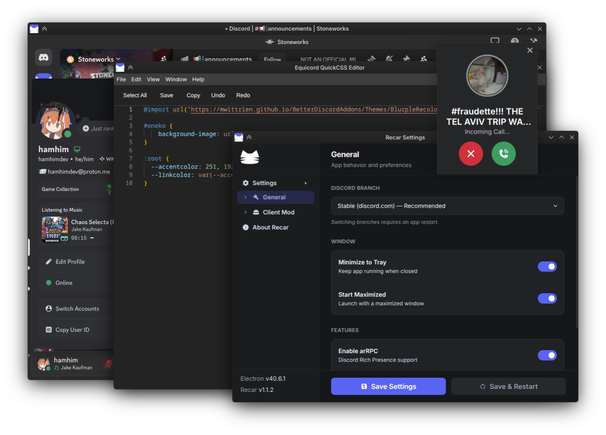

 

### A Linux Discord Client

Recar is a Discord client for Linux with client mods and extra functionality.  
https://recar.loxodrome.app/

> [!WARNING]
> Recar is still in alpha! Things may be broken, missing, or change unexpectedly.

## Features

- RPC server built in (for Rich Presence)
- Custom call popup when ringing
- Switch between Vencord & Equicord
- Wayland Streaming
- Streaming from OBS Studio (no audio at the moment)
- Superior Desktop Notifications
- Recar exclusive plugins ("CatboxUpload" and "ControllerSupport(Experimental)" for now)

## Installing Recar

https://recar.loxodrome.app/docs/info/install/

## License

**recar, [dppRPC](https://git.unium.in/dpprpc/file/README.md.html) & [roverpp](https://git.unium.in/roverpp/file/README.md.html) (overlay)**  
MIT License  
[recar License](./LICENSE)  
[roverpp License](https://git.unium.in/?r=roverpp&a=blob&p=README.md&c=HEAD)
[dppRPC License](https://git.unium.in/?r=dpprpc&a=blob&p=README.md&c=HEAD)
